# Pandas_Challenge02
# School District Analysis

## Challenge Objective/Processes
1. Open Jupyter Notebook files from local directories using a development environment.
2. Read an external CSV file into a DataFrame.
3. Format a DataFrame column.
4. Determine data types of row values in a DataFrame.
5. Retrieve data from specific columns of a DataFrame.
6. Merge, filter, slice, and sort a DataFrame.
7. Apply the groupby() function to a DataFrame.
8. Use multiple methods to perform a function on a DataFrame.
9. Perform mathematical calculations on columns of a DataFrame or Series.

## Background
As the new Chief Data Scientist, you help the school board and mayor make strategic decisions regarding school budgets and priorities

You have been tasked with analyzing the district-wide standardized test results by aggregating the data to show trends in school performance.

## Results

In this district of 15 schools (7 Public District Schools and 8 Charter Schools), 39,170 students are served. The 15 schools operate with a combined budget of over $24.6M. Of all the students in the district, 65% of them are passing both math and reading, with reading appearing to be the strongest subject for all schools, as over 85% of students are passed reading, and the average reading score is well over 81.

* Across all metrics, Charter schools out-performed District schools. More analysis would be needed to determine why this could be, but it appears that most Charter schools in this district are smaller institutions--and the larger schools also seem to score lower in all metrics.
* Schools that spend less per student had much better results in % Overall Passing than all other levels of spending per captia. This finding could potentially serve as grounds for futher examination of how individual budgets are managed.

### District Summary
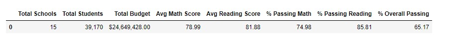

### Schools Summary
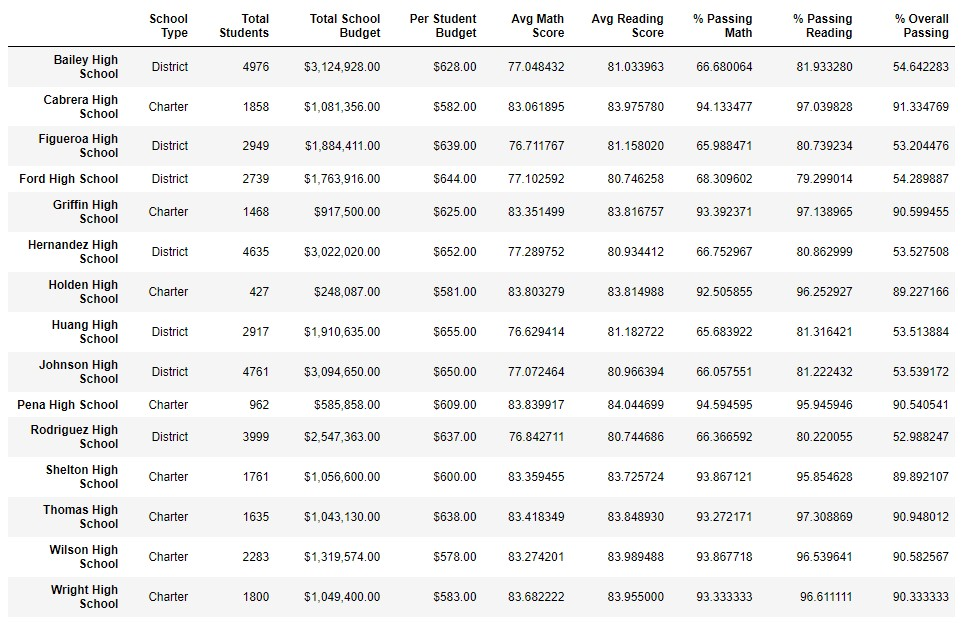

### Top 5 Performing Schools
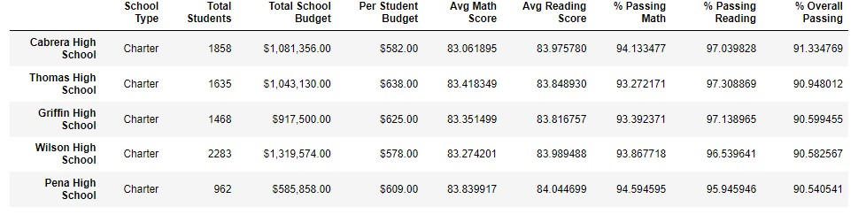

### Bottom 5 Performing Schools
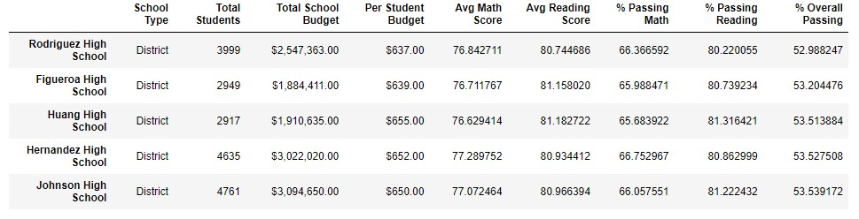

### Math Scores by Grade
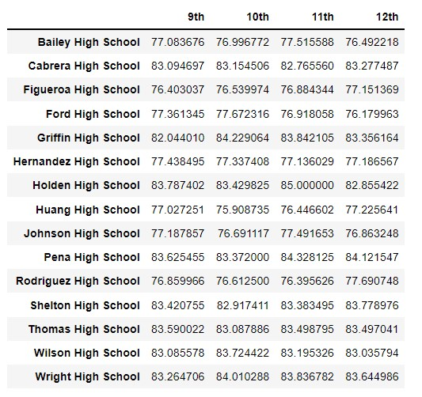

### Reading Score by Grade
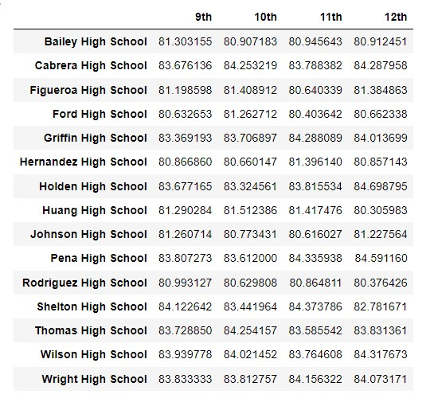

### Scores by School Spending
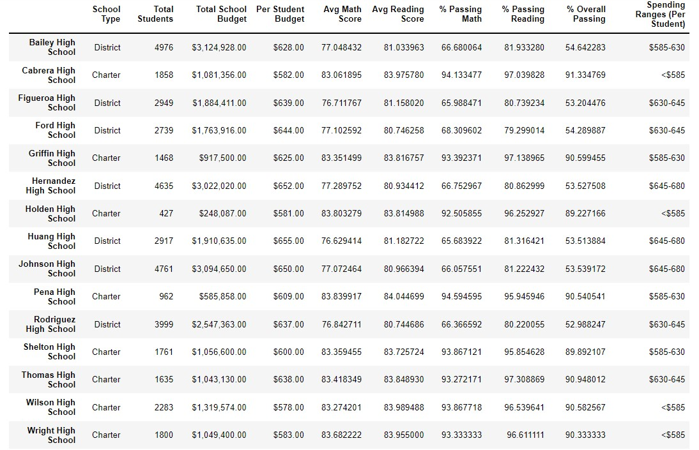
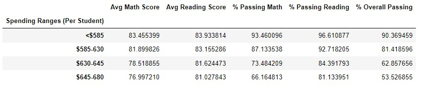

### Scores by School Size
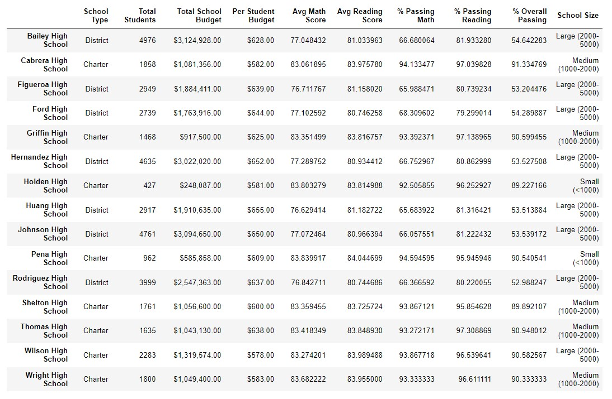
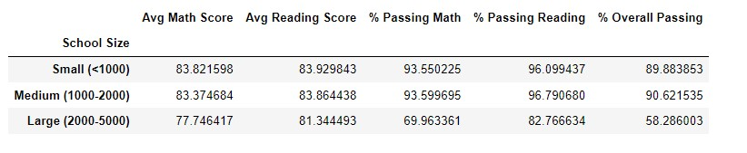

### Scores by School Type
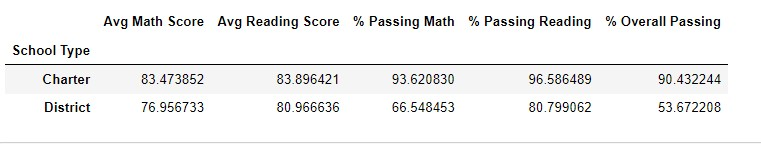

